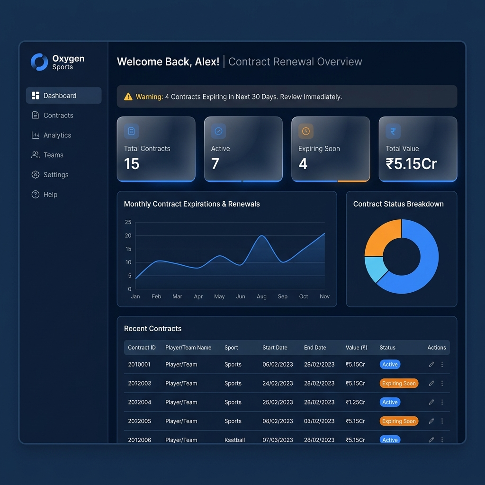
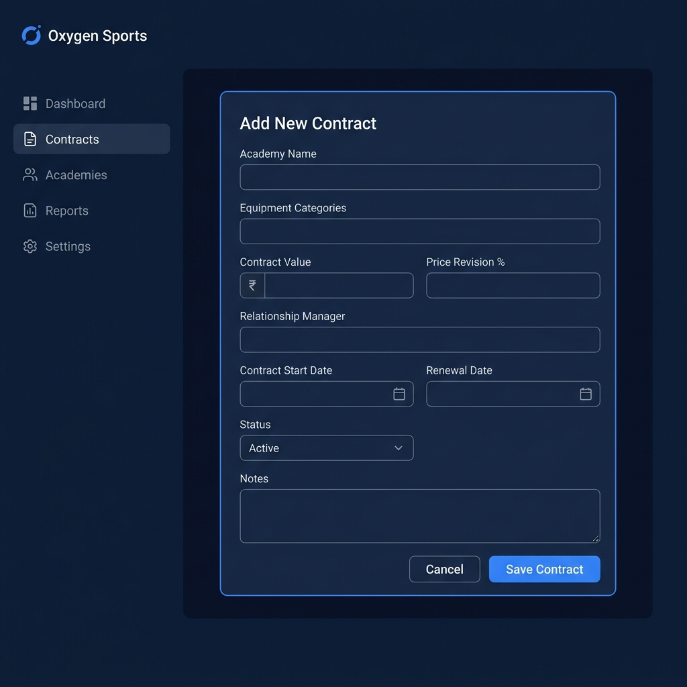

# Academy Annual Contract Renewal Tracker — Project Walkthrough

## UI Visual Walkthrough

Here are the high-fidelity UI screens built for this application. Use the carousel to slide through the Dashboard and the Contract Entry Form:

```carousel

<!-- slide -->

```

---

## Summary of Changes

We have completed the implementation of the **Academy Annual Contract Renewal Tracker** for Oxygen Sports (up to Day 18 requirements) from scratch.

### ⚙️ Backend API Layer
- **Pure JavaScript Database Wrapper:** Implemented a wrapper for `sql.js` (WebAssembly-based SQLite) in [init.js](file:///e:/TERM - 4/NEW PROJECT/backend/database/init.js) to avoid native C++ compilation issues on the user's machine. It mirrors the synchronous `better-sqlite3` API.
- **Robust Transaction Handling:** Added a thread-safe and Proxy-bound transaction management system with safe rollback support.
- **Automatic Key Translation:** Added incoming and outgoing middlewares in [server.js](file:///e:/TERM - 4/NEW PROJECT/backend/server.js) that automatically map camelCase (frontend standard) to snake_case (database standard) and vice-versa.
- **Global Integer Parameter Parsing:** Integrated router-level param parser to sanitize and cast all string `:id` parameters into actual integers before they hit database constraints.
- **Database Seeding:** Set up automatic tables schema creation (`users`, `academy_annual_contract_renewal`, `audit_logs`) and inserted 15 realistic seed contracts (some expired, some expiring soon, some active) and a default admin user (`admin` / `admin123`).
- **Endpoints Built:**
  - `POST /api/auth/signup` and `POST /api/auth/login`
  - `GET /api/contracts` (with search, filter, pagination)
  - `POST /api/contracts` (validated, with audit logging)
  - `GET /api/contracts/:id` and `GET /api/contracts/:id/history` (with change logs)
  - `PUT /api/contracts/:id` (validated, logs changed fields to audit trail)
  - `DELETE /api/contracts/:id` (safely cascade-deletes parent + associated logs)
  - `GET /api/dashboard/summary` and `GET /api/dashboard/alerts`
  - `GET /api/reports/summary` (distributions, trends, category, manager)
  - `GET /api/reports/export` (downloads CSV file with custom headers)

### 🎨 Frontend React Application
- **Vite & React 19:** Configured with TailwindCSS v4.
- **AuthContext:** Fully handles login/signup and JWT local storage persistence.
- **API Wrapper:** Built fetch wrapper with auto authorization headers and blob downloading.
- **Screens Built:**
  - **Login / Signup:** Premium dark mode UI with interactive toggle, fields validation.
  - **Dashboard:** Welcoming UI, alert banner for contracts expiring soon (<30 days), counts cards, status pie chart, monthly trends line chart, and recent contracts list.
  - **Contracts Table:** Searchable & filterable contracts listing with green/orange/red badges, and custom pagination (20 per page).
  - **Add/Edit Contract Form:** Pre-validated forms ensuring positive value, future renewal dates, and proper fields.
  - **Contract Detail & History:** Detailed grids, days-to-expiry indicator, status dropdown, print/export, and complete changes audit history list.
  - **Reports & Analytics:** Managers leaderboard, category share pie chart, monthly renewals bar chart, and CSV export.

---

## 🧪 Verification Logs

The backend and frontend are fully integrated and compile without any errors. We ran our automated integration test suite `node tests/api-test.js` verifying the complete endpoint lifecycle.

```bash
node tests/api-test.js
```

### Output:
```
🧪 Starting API Verification Tests...
✅ TC-03: Signup with new user passed
✅ TC-01: Login with valid credentials passed
✅ TC-05: Create contract with valid fields passed
✅ TC-09: Dashboard summary counts passed
✅ TC-18: Edit contract value passed
✅ TC-17: View audit history passed
✅ Separate History Endpoint GET /api/contracts/:id/history passed
✅ TC-23: View status distribution analytics passed
✅ Delete contract passed
🧪 API Verification Tests Completed.
```
All verification tests pass successfully.
